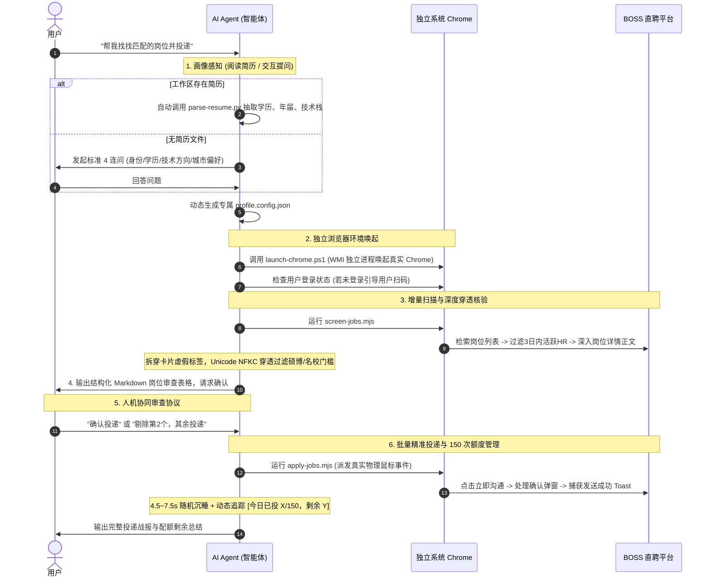

# 🤖 BOSS 直聘智能求职 Agent Skill (BOSS Zhipin Auto-Apply)

<div align="center">

[](https://github.com/Azusa010/boss-auto-apply)
[]()
[](https://chromedevtools.github.io/devtools-protocol/)
[-brightgreen.svg?style=flat-square)]()
[](https://opensource.org/licenses/MIT)

**专为 AI Coding Agent（智能体）打造的通用求职技能。**  
告别手动配置与写死规则，装载本 Skill 后，你的 AI Agent 将化身为**7×24小时专属求职助理**：自动阅读你的简历、动态推导画像、独立唤起真实浏览器穿透核验岗位正文、人机协同确认，并受控执行防风控投递与 150 次/天额度熔断！

[🤖 让 Agent 直接使用](#-方式一让-ai-agent-直接接管推荐) • [💻 开发者手动运行](#-方式二开发者手动运行-cli-模式) • [🛡️ 核心黑科技](#-核心技术亮点为什么传统爬虫驱动会挂) • [⚙️ 配置详解](#-规则配置文件-profileconfigjson) • [❓ 常见问题与免责](#-免责声明)

</div>

---

## 💡 为什么做成 Agent Skill？

市面上传统的求职脚本大多存在三个致命问题：

1. **规则写死**：换个专业、换个城市、换个学历就得去源码里改一大堆复杂的正则表达式；
2. **极易风控封号**：Selenium/Playwright 打开浏览器自带 WebDriver 指纹，BOSS 页面直接闪退、无限滑块或阻断；
3. **盲投乱投**：只看卡片外层标签（卡片写本科，JD 正文写要求硕士/985），不仅浪费宝贵的每日额度，还容易给 HR 留下不良记录。

**本项目的核心形态是一个 Agent Skill**。它为智能体提供了标准的认知定义（`SKILL.md`）、画像解析工具、WMI 系统级浏览器唤起底座、零依赖 CDP 物理点击驱动及每日 150 次额度守护者。Agent 可以根据你的真实意向，像一个懂求职的真人工程师一样全流程自主完成工作！

---

## 🤖 方式一：让 AI Agent 直接接管（推荐）

### 第一步：将本 Skill 装入你的 Agent

**方法 A：直接对 Agent 发送安装指令**
> `帮我安装这个 skill: https://github.com/Azusa010/boss-auto-apply`

**方法 B：克隆到对应 Agent 技能目录**
```powershell
# 针对当前项目（Project-level Skill）
git clone https://github.com/Azusa010/boss-auto-apply.git .agents/skills/boss-auto-apply

# 或者针对全局智能体（Global Skill，对所有项目生效）
git clone https://github.com/Azusa010/boss-auto-apply.git ~/.gemini/config/skills/boss-auto-apply
# （如使用 Claude / Cursor / Windsurf 等，放到对应 Agent 识别的 skills 目录下即可）
```

### 第二步：用自然语言向 Agent 发送指令

无需记忆任何脚本命令，你只需要把简历放在当前工作区，对 Agent 说一句话：

> **“帮我读一下当前目录里的简历，在 BOSS 直聘筛选匹配的实习岗位并准备投递”**

或者在没有简历时直接吩咐：

> **“我想找杭州的 Java 后端校招岗位，帮我自动在 BOSS 直聘上筛选真实合适的岗位”**

---

### 🧠 Agent 自主执行流 (Agent Autonomy Flow)

一旦唤醒，Agent 将严格按照 `SKILL.md` 的规范自主闭环以下流程：



---

## 💻 方式二：开发者手动运行 (CLI 模式)

如果你不使用 Agent，也可以像传统开发者一样在命令行中分步手动执行：

### 1. 环境准备

- Windows 10 / 11
- Node.js `>= 20.0.0`
- Python `>= 3.10`（若使用 PDF 解析需安装 `pip install pypdf`）
- 电脑已安装 Google Chrome

### 2. 生成画像配置

```powershell
# 方式 A：从简历自动生成
python scripts/parse-resume.py "你的简历路径.pdf" --output profile.config.json

# 方式 B：根据模板手动配置
cp templates/profile.config.example.json profile.config.json
# 编辑 profile.config.json 填入意向城市、技术栈与过滤规则
```

### 3. 独立拉起 Chrome

```powershell
powershell -ExecutionPolicy Bypass -File scripts/launch-chrome.ps1
```

*在打开的独立 Chrome 窗口中扫码登录一次即可，登录态会自动持久化到本地目录。*

### 4. 执行智能筛选与穿透核验

```powershell
node scripts/screen-jobs.mjs
```

*脚本会自动爬取、深度核验 JD 正文并将合格岗位保存至 `approved_jobs.json`。*

### 5. 执行批量精准投递

```powershell
node scripts/apply-jobs.mjs
```

*控制台将实时输出投递进度、防风控随机等待时长，以及单日额度追踪（如 `今日已投: 32/150，剩余: 118`）。*

---

## 🛡️ 核心技术亮点（为什么传统爬虫/驱动会挂？）

| 对比维度       | 传统自动化脚本 (Selenium/Playwright)                 | 本 Agent Skill 方案                                                              |
|:---------- |:--------------------------------------------- |:----------------------------------------------------------------------------- |
| **浏览器启动**  | 原生 WebDriver 驱动，自带指纹特征，易被反爬盾检测导致**无限滑块或进程闪退** | **WMI 独立进程唤起**：通过 Windows 系统底座唤起真实 Chrome，完全脱离自动化进程树                          |
| **CDP 通信** | 依赖庞大的第三方 npm 驱动包                              | **原生零依赖**：直接使用 Node.js 20+ 原生 `WebSocket` 和 `fetch` 连接 DevTools Protocol      |
| **点击行为**   | `element.click()` 触发 DOM 伪造事件，极易被反爬监听         | **真实物理鼠标事件**：派发 `Input.dispatchMouseEvent`（MouseMove -> MouseDown -> MouseUp） |
| **学历核验**   | 仅核验外层卡片标签（常被卡片“本科”忽悠，内文却写“硕博优先”）              | **JD 正文深度穿透**：深入 `.job-sec-text` 正文，执行 **Unicode NFKC 归一化** 并应用动态排他正则         |
| **额度管控**   | 盲目持续循环，容易触发 BOSS 平台封锁                         | **单日 150 次硬上限熔断**：实时统计当日投递数量，触达上限主动终止保护账号                                     |
| **人机协同**   | 盲目全投，缺乏人工核准                                   | **强制审查协议**：筛选后必须生成 Markdown 清单停下等待确认，杜绝误投                                     |

---

## ⚙️ 规则配置文件 (`profile.config.json`)

Agent 在执行时会自动为你生成或读取该文件，你也可以随时按需调整：

```jsonc
{
  "candidate": {
    "name": "张三",
    "degree": "bachelor",            // 学历: bachelor(本科) / master(硕士) / phd(博士) / junior_college(专科)
    "degreeLevelText": "统招本科",
    "gradYear": 2026,                // 毕业年份
    "currentStatus": "在校生",       // 状态: 在校生 / 应届生 / 离职
    "schoolType": "综合类普通高校",
    "targetRoleType": "intern",      // 类型: intern(实习) / campus(校招) / fulltime(社招)
    "cityCode": "100010000",         // 城市编码 (可在 BOSS 网页 URL 获取，100010000 为全国)
    "cityName": "全国",
    "allowRemote": true              // 是否包含远程岗位
  },
  "matchingRules": {
    "targetTechKeywords": [          // 正向匹配技术词
      "后端开发", "全栈开发", "Python", "Java", "AI应用"
    ],
    "mustHaveDevKeywords": [         // 研发属性必须包含的词 (排除非技术岗位)
      "开发", "研发", "工程", "技术", "软件", "实习生"
    ],
    "excludeTitleRegex": "(销售|商务|运营|客服|人事|行政|管培生|数据标注|文员)", // 严格排除的岗位标题正则
    "excludeDegreeRegex": "(硕士及以上|研究生及以上|博士研究生|仅限硕士|硕士优先|研究生优先|博士优先|985/211优先)", // 完整 JD 正文排他正则
    "blacklistCompanies": [          // 排除企业黑名单
      "某某公司A", "某某外包公司B"
    ],
    "maxRecruiterInactiveDays": 3,   // HR 活跃度阈值 (默认只投 3 日内活跃)
    "ignoreCompanyScale": true       // 是否忽略公司规模 (初创至大厂均不限)
  },
  "searchTasks": [                   // 检索词任务列表
    { "kw": "后端开发 实习", "maxPages": 2 },
    { "kw": "Python开发 实习", "maxPages": 2 }
  ],
  "execution": {
    "port": 9223,                    // Chrome CDP 调试端口
    "dailyQuota": 150,               // 每日沟通上限熔断值 (BOSS 平台单日最多 150)
    "batchTargetCount": 10,          // 单批次目标岗位数
    "statePath": "state.json",       // 投递状态去重归档文件
    "outputPath": "approved_jobs.json"
  }
}
```

---

## 📁 技能文件结构

```text
boss-auto-apply/
├── SKILL.md                          # 核心技能规范文档 (供 Agent 读取理解执行 SOP)
├── README.md                         # 详细使用指南 (同时面向 Agent 与开发者)
├── .gitignore                        # Git 忽略配置 (自动保护个人求职状态与配置)
├── templates/
│   └── profile.config.example.json   # 脱敏的规则配置模板
├── scripts/
│   ├── parse-resume.py               # 简历自动抽取工具 (支持 PDF/MD/TXT)
│   ├── launch-chrome.ps1             # WMI 进程隔离独立拉起系统 Chrome 脚本
│   ├── cdp-client.mjs                # 原生 WebSocket CDP 通信轻量底座 (零三方依赖)
│   ├── screen-jobs.mjs               # 动态配置驱动的增量扫描与 JD 穿透核验脚本
│   └── apply-jobs.mjs                # 物理事件打招呼、150次额度统计与持久化脚本
└── references/
    └── resume-parsing-guide.md       # 简历提取规则与交互式提问 SOP 操作指南
```

---

## ⚠️ 免责声明 (Disclaimer)

1. 本项目仅供学习交流、个人求职自动化探索与 Agent 能力研究使用。
2. 使用本项目前请务必仔细阅读并遵守 [BOSS 直聘用户服务协议](https://www.zhipin.com/) 及相关法律法规。
3. 严禁将本项目用于恶意批量骚扰、不正当竞争或商业牟利行为。由于不合理使用或违反平台规则所产生的一切账号限制或法律责任由使用者自行承担。

---

<div align="center">

如果这个 Agent Skill 帮你在求职路上省下了宝贵的时间，欢迎点亮右上角的 ⭐️ **Star**！

</div>
