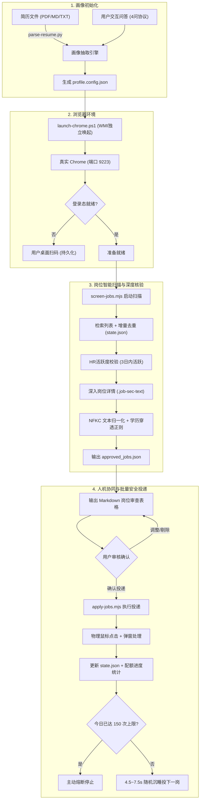

# 🚀 BOSS 直聘自动化精准投递智能体 (BOSS Zhipin Auto-Apply Agent)

<div align="center">

[](https://nodejs.org/)
[](https://python.org/)
[](https://chromedevtools.github.io/devtools-protocol/)
[-brightgreen.svg?style=flat-square)]()
[](https://opensource.org/licenses/MIT)

**面向 BOSS 直聘的新一代智能求职助手：支持简历解析/人机交互双模式画像自适应、深度穿透岗位正文核验学历、WMI 独立系统级浏览器防风控驱动、平台 150 次/天沟通配额熔断管理。**

[English Introduction](#overview-en) • [核心特性](#-核心特性) • [系统架构](#-系统架构) • [快速开始](#-快速开始) • [配置详解](#-配置文件详解-profileconfigjson) • [常见问题](#-常见问题--免责声明)

</div>

---

## 🌟 核心特性

- 🧠 **双模式自适应画像注入 (Adaptive Persona Bootstrapping)**
  - **模式 A（简历自动解析）**：内置智能解析脚本，从 PDF/Markdown/TXT 简历中自动提取毕业年份、学历门槛、求职身份（日常实习/校招/社招）及专业技能栈；
  - **模式 B（交互式问答推导）**：标准化 4 连问交互问答协议，针对无简历用户，由智能体动态生成专属过滤与匹配配置；
  - **零硬编码**：支持专科/本科/硕士/博士全学历，支持研发/全栈/前端/AI/产品等多方向。

- 🛡️ **WMI 独立进程唤起与原生 CDP（彻底告别驱动闪退与反爬拦截）**
  - **脱离进程树**：严禁使用 Playwright/Selenium 等易被反爬指纹识别的 WebDriver 包装层；
  - 使用 Windows WMI (`Win32_Process`) 唤起系统真实安装的 Google Chrome，监听 `9223` 调试端口，彻底解决自动化进程意外闪退、验证码循环拦截问题；
  - **零三方依赖通信**：仅依靠 Node.js 原生 `WebSocket` 和 `fetch` 连接 Chrome DevTools Protocol，轻量纯净；
  - **真实物理鼠标事件**：派发 `Input.dispatchMouseEvent`（MouseMove -> MouseDown -> MouseUp），模拟真人手势点击。

- 🔍 **完整 JD 内文深度穿透核验（拆穿外层卡片虚假标签）**
  - BOSS 列表卡片往往粗放标注（如外层卡片标“本科”，但内文任职要求写“硕士及以上/985优先”）；
  - 本工具在初筛后**深入岗位详情页**，提取完整的 `.job-sec-text` 正文并执行 **Unicode NFKC 全角/半角归一化**；
  - 动态应用排他性正则，凡出现学历门槛冲突、隐性名校限制（如 985/211 硬性限定）的岗位坚决剔除，绝不浪费宝贵沟通机会。

- 🚦 **人机协同审查安全协议 (Human-in-the-Loop Review)**
  - 严格落实**“投递前人工审查”**原则，筛选出的合格岗位首先汇总为清晰的 Markdown 岗位列表；
  - 智能体等待用户确认（如“确认投递”或“剔除第 1、3 个岗位”）后，方才启动批量打招呼，杜绝盲投误投。

- 📊 **平台 150 次/天沟通配额精细管控 (Daily Quota Guard)**
  - BOSS 直聘平台单日主动沟通上限为 **150 次**；
  - 投递脚本实时追踪当日累计投递数量，每成功打招呼一个岗位即更新进度（如 `今日已投 64/150，剩余 86`）；
  - 累计达到 150 次时自动熔断并退出，防止账号触发平台频控或被限制。

- 🕊️ **防风控与优雅熔断**
  - 单岗投递间隔引入 4.5 ~ 7.5 秒随机沉睡，全真模拟阅读与思考节奏；
  - 遇到安全验证码滑块、登录失效或平台“过于频繁”提示，立即安全终止，并提醒用户手动干预。

---

## 🏗️ 系统架构



---

## 📁 目录结构

```text
boss-auto-apply/
├── README.md                          # 项目中文详细说明
├── SKILL.md                          # 技能规范与 Agent 执行提示词定义
├── .gitignore                        # Git 忽略配置 (防止泄露个人投递记录与配置)
├── templates/
│   └── profile.config.example.json   # 候选人画像与规则配置模板 (已完全脱敏)
├── scripts/
│   ├── parse-resume.py               # 简历自动抽取工具 (Python, 支持 PDF/MD/TXT)
│   ├── launch-chrome.ps1             # WMI 进程隔离拉起真实系统 Chrome 脚本
│   ├── cdp-client.mjs                # 原生 WebSocket CDP 通信轻量底座 (零三方依赖)
│   ├── screen-jobs.mjs               # 动态配置驱动的增量扫描与 JD 穿透核验脚本
│   └── apply-jobs.mjs                # 物理事件打招呼、150次额度统计与持久化脚本
└── references/
    └── resume-parsing-guide.md       # 简历解析与交互式提问 SOP 操作指南
```

---

## ⚡ 快速开始

### 1. 环境准备
- **操作系统**：Windows 10 / 11（WMI 唤起脚本基于 PowerShell）
- **Node.js**：版本 `>= 20.0.0`
- **Python**：版本 `>= 3.10`（若使用 PDF 解析需安装 `pypdf`：`pip install pypdf`）
- **浏览器**：Google Chrome（系统已安装）

### 2. 克隆项目与配置画像
根据模板创建您的配置：
```powershell
cp templates/profile.config.example.json profile.config.json
```

**方法 A：如果您有简历文件**
```powershell
python scripts/parse-resume.py "你的简历路径.pdf" --output profile.config.json
```
**方法 B：如果您直接手动填写**
编辑 `profile.config.json`，按实际情况设置学历、目标关键词、城市及排除词。

### 3. 独立唤起系统 Chrome
```powershell
powershell -ExecutionPolicy Bypass -File scripts/launch-chrome.ps1
```
> **提示**：Chrome 会在独立目录（默认 `~/.boss-chrome/profile`）启动，避免污染您日常的浏览器窗口。若首次运行未登录，在打开的页面扫码登录一次即可，登录凭证会自动持久化。

### 4. 扫描岗位并穿透核验
```powershell
node scripts/screen-jobs.mjs
```
脚本将按配置检索岗位，自动剔除历史已投递记录，逐个进入详情页核验学历门槛与技术匹配度，并将合格岗位保存到 `approved_jobs.json`。

### 5. 审查确认并批量精准投递
核对岗位无误后，启动投递：
```powershell
node scripts/apply-jobs.mjs
```
投递脚本将逐一模拟真人操作发送打招呼，并在控制台实时输出当天额度状态：
```text
[1/8] 检查并投递: 某某科技 - 软件研发工程师 (200-300元/天)
   ✉️ 触发【立即沟通】...
   ✅ 成功发送打招呼 (1/8) | 今日已投: 45/150，剩余: 105
   ⏳ 模拟真人行为，随机防风控等待 6.2 秒...
```

---

## ⚙️ 配置文件详解 (`profile.config.json`)

```jsonc
{
  "candidate": {
    "name": "张三",
    "degree": "bachelor",            // 学历层级: bachelor(本科) / master(硕士) / phd(博士) / junior_college(专科)
    "degreeLevelText": "统招本科",
    "gradYear": 2026,                // 毕业年份
    "currentStatus": "在校生",       // 当前状态: 在校生 / 应届生 / 离职
    "schoolType": "综合类普通高校",
    "targetRoleType": "intern",      // 求职类型: intern(实习) / campus(校招) / fulltime(社招)
    "cityCode": "100010000",         // 城市编码 (可在 BOSS 网页 URL 中获取，100010000 为全国)
    "cityName": "北京",
    "allowRemote": true
  },
  "matchingRules": {
    "targetTechKeywords": [          // 正向匹配技术关键词 (命中任意一个即视为对口)
      "后端开发", "全栈开发", "Python", "Java", "AI应用"
    ],
    "mustHaveDevKeywords": [         // 研发属性必须包含的词 (排除非技术岗位)
      "开发", "研发", "工程", "技术", "软件", "实习生"
    ],
    "excludeTitleRegex": "(销售|商务|运营|客服|人事|行政|管培生|数据标注|文员)", // 严格排除的岗位名称正则
    "excludeDegreeRegex": "(硕士及以上|研究生及以上|博士研究生|仅限硕士|硕士优先|研究生优先|博士优先|985/211优先)", // 完整 JD 深度穿透排除正则
    "blacklistCompanies": [          // 企业黑名单 (包含这些名称的任何岗位均不投递)
      "某某公司A", "某某外包公司B"
    ],
    "maxRecruiterInactiveDays": 3,   // HR 活跃度阈值 (仅投 3 日内活跃)
    "ignoreCompanyScale": true       // 是否忽略公司人数规模 (小微初创至千人大厂均不设限)
  },
  "searchTasks": [                   // 批次检索任务列表
    { "kw": "后端开发 实习", "maxPages": 2 },
    { "kw": "Python开发 实习", "maxPages": 2 }
  ],
  "execution": {
    "port": 9223,                    // Chrome CDP 调试端口
    "dailyQuota": 150,               // 每日沟通上限熔断值 (BOSS 平台单日最多 150)
    "batchTargetCount": 10,          // 单批次收集目标岗位数
    "statePath": "state.json",       // 投递状态归档文件
    "outputPath": "approved_jobs.json"
  }
}
```

---

## 🔒 隐私与风控防护建议

1. **凭证隔离与数据安全**：
   - 包含个人投递进度的 `state.json`、生成的 `approved_jobs.json` 以及本地浏览器 Profile 已默认包含在 `.gitignore` 中，绝不会意外提交至公网仓库。
2. **遵守平台规范**：
   - BOSS 直聘严格限制单日沟通次数上限为 **150 次**，请勿尝试通过多账号或恶意高频手段绕过，避免导致账号受限。
3. **保持真人巡检**：
   - 投递过程中如遇滑动验证码，脚本会主动暂停并发出蜂鸣/日志提示，请在浏览器中手动完成滑动拼图后再继续。

---

## ❓ 常见问题 & 免责声明

**Q1：为什么不直接用 Playwright 或 Puppeteer？**
> BOSS 直聘拥有极为严格的反自动化检测策略，直接通过自动化框架启动的 Chromium 会暴露 `navigator.webdriver`、自动化指纹及特有渲染特征，容易遭遇无限刷新、验证码死循环或直接进程闪退。本项目采用系统真实 Chrome + WMI 独立进程 + 原生 CDP 物理事件，完全与普通真人使用同一套浏览器内核环境。

**Q2：运行脚本提示“连接 Chrome CDP 失败”？**
> 请确保已优先运行 `powershell -File scripts/launch-chrome.ps1` 拉起浏览器，并确认 Chrome 启动参数中包含 `--remote-debugging-port=9223`。

---

### ⚠️ 免责声明 (Disclaimer)

- 本项目仅供技术交流与学术研究使用，旨在探索 Chrome DevTools Protocol 自动化技术与 LLM Agent 在求职场景中的辅助落地。
- 使用本项目前请务必仔细阅读并遵守 [BOSS 直聘用户协议](https://www.zhipin.com/) 及相关服务条款。
- 严禁将本项目用于任何形式的商业滥用、恶意高频骚扰或违法活动。开发者对使用本项目可能导致的任何账号限制或法律纠纷不承担任何连带责任。

---

<div align="center">

如果这个项目对你的求职与自动化探索有所帮助，欢迎给它点亮一颗 ⭐️ **Star**！

</div>
