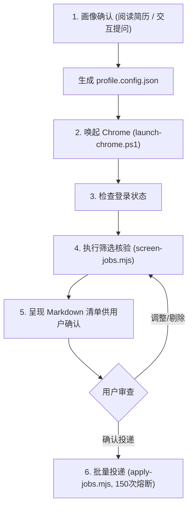

# BOSS 直聘通用自动化筛选与精准投递 Skill (Generic Version)

本 Skill 是面向任意候选人的**通用化** BOSS 直聘岗位筛选与自动化投递系统。与特定项目硬编码规则不同，本系统支持**“简历文件自动识别”**与**“交互式问答推导”**两种模式，能够自适应任意学历层次、任意求职类型（实习/校招/社招）及任意专业方向。

---

## 目录结构

```text
boss-auto-apply/
├── SKILL.md                          # 核心规范与使用指南
├── templates/
│   └── profile.config.example.json   # 候选人画像与规则配置全字段示例模板
├── scripts/
│   ├── parse-resume.py               # 简历自动提取工具 (支持 PDF/MD/TXT)
│   ├── launch-chrome.ps1             # WMI 进程隔离独立拉起系统 Chrome (避开反爬)
│   ├── cdp-client.mjs                # 原生 WebSocket CDP 通信底座 (零三方依赖)
│   ├── screen-jobs.mjs               # 动态配置驱动的增量抓取与完整 JD 穿透核验脚本
│   └── apply-jobs.mjs                # 物理鼠标事件打招呼、150次/天额度熔断与状态归档
└── references/
    └── resume-parsing-guide.md       # 简历提取规则与交互式提问模板指南
```

---

## 核心架构原则

1. **动态画像自适应驱动**：
   - 不预设任何固定的学历要求、学校标签、目标技术栈或排除公司；
   - 优先通过 `parse-resume.py` 读取本地简历，提取学历、毕业届数、专业技能；
   - 若无简历或信息不完整，通过标准问答协议向用户提问，动态生成本地 `profile.config.json`。

2. **WMI 独立进程唤起（防闪退与反爬盾）**：
   - 严禁使用 Playwright/Selenium 等自动化驱动（BOSS 存在严格的 Canvas/WebGL/自动化指纹检测，会导致无限刷新、滑块死锁或浏览器闪退）；
   - 使用 `scripts/launch-chrome.ps1` 通过 WMI (`Win32_Process`) 唤起系统真实 Chrome，绑定调试端口 `9223`，并隔离本地持久化用户目录（如 `~/.boss-chrome/profile`）。

3. **零外部重型依赖的原生 CDP 通信**：
   - 基于 Node.js (>=20) 内置的 `WebSocket` 和 `fetch` 直连 Chrome CDP (`ws://127.0.0.1:9223`)；
   - 页面点击通过 `Input.dispatchMouseEvent` 发送真实的物理鼠标事件（`mouseMoved` -> `mousePressed` -> `mouseReleased`），绕过 DOM 级点击指纹追踪。

4. **JD 正文字符串深度穿透核验（必须检查 `.job-sec-text`）**：
   - BOSS 列表卡片往往粗放标注（如卡片写“本科”，内文要求“硕士及以上/985优先”）；
   - 自动化流程必须读取完整的岗位正文，经 Unicode NFKC 规范化后执行动态正则核验，不符合候选人条件的岗位坚决剔除。

5. **每日 150 次额度管控与防风控熔断**：
   - BOSS 直聘每日沟通上限为 **150 次/天**；
   - 脚本在投递前后动态统计当天已投总量，每投一个岗位均实时输出配额进度（如 `今日已投 64/150，剩余 86`）；
   - 当单日达到 150 次时自动熔断停止，防止账号被限制；
   - 遇滑动验证码、登录失效或“过于频繁”提示，立即中断投递并提醒用户。

6. **投递前人机审查协议**：
   - **严禁未经用户审查私自投递**！筛选出候选岗位后，必须输出结构化 Markdown 表格供用户检阅，等待用户明确确认或调整指令后方可触发投递。

---

## 标准操作执行流程 (SOP)



### 第一步：确立求职者画像并生成配置

智能体在任务开始前，先检查工作区是否存在简历文件或已有的 `profile.config.json`：
- **若存在简历文件（如 `resume.pdf`）**：
  ```powershell
  python scripts/parse-resume.py resume.pdf
  ```
  读取解析输出后，向用户简要确认，并将参数写入 `profile.config.json`。
- **若无简历文件**：
  参照 [resume-parsing-guide.md](file:///d:/BaiduNetdiskDownload/dailyProjects/boss/generic-skill/boss-auto-apply/references/resume-parsing-guide.md) 发起核心 4 连问：
  1. 求职身份（日常实习/校招应届/社招全职）
  2. 学历层次与毕业年份（用于动态生成学历剔除正则）
  3. 目标岗位与核心技术栈（正向技术词与反向排斥词）
  4. 目标城市与排除企业黑名单
  确认后生成 `profile.config.json`（可参考 `templates/profile.config.example.json`）。

### 第二步：唤起独立 Chrome 并验证登录

```powershell
powershell -ExecutionPolicy Bypass -File scripts/launch-chrome.ps1
```
检查或导航至 `https://www.zhipin.com/web/user/?intent=0`，若未登录，请用户在桌面端扫码登录一次即可，登录凭证会自动持久化。

### 第三步：执行岗位检索与深度穿透清洗

```powershell
node scripts/screen-jobs.mjs
```
脚本将按配置中的检索词和过滤规则进行抓取：
- 自动剔除 `state.json` 中已投递或已记录的岗位；
- 检查 HR 活跃状态（3 日内活跃）；
- 深入每个岗位详情页，提取完整 `.job-sec-text` 正文；
- 应用学历与技术栈正则穿透过滤；
- 抓取通过的合格岗位输出至 `approved_jobs.json`。

### 第四步：输出审查清单供用户确认

智能体将筛选出的岗位汇总为结构化 Markdown 审查表格：

| 序号 | 公司名称 | 岗位名称 | 薪资待遇 | 公司规模 | HR 活跃状态 | 学历核验 | 核心匹配点 / 业务场景 |
| :---: | :--- | :--- | :--- | :--- | :--- | :--- | :--- |
| 1 | 示例智能科技 | AI应用研发工程师 | 200-300元/天 | 20-99人 | 🟢 在线 | ✅ 统招本科及以上 | LLM应用开发、RAG智能问答构建 |

> [!IMPORTANT]
> **必须停下当前步骤等待用户确认！** 用户可指出“剔除第2、第5个，其余投递”或直接“确认投递”。

### 第五步：执行自动化投递与状态持久化

用户确认后，执行投递脚本：
```powershell
node scripts/apply-jobs.mjs
```
- 读取 `approved_jobs.json` 与 `state.json`；
- 校验今日已投递额度（若已满 150 次则熔断退出）；
- 逐个打开详情页，触发立即沟通（若为“继续沟通”则自动跳过）；
- 自动处理二次弹窗确认，捕获“发送成功”Toast；
- 每次打招呼后执行 4.5 ~ 7.5 秒随机沉睡，并原子化持久化记录到 `state.json`；
- 输出当日总投递进度：`今日已投 X/150，剩余 Y`。
